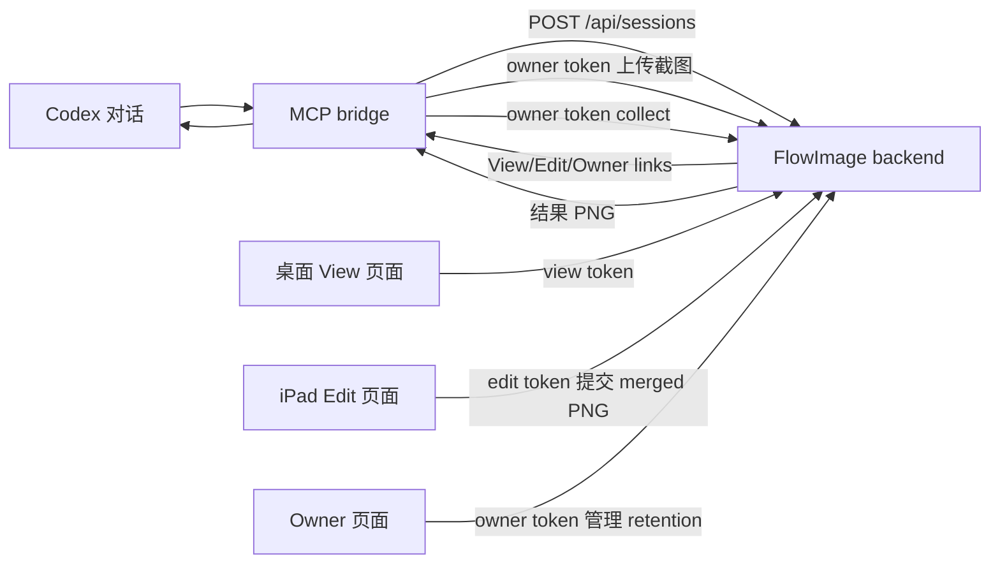

# FlowImage 当前落地实现文档

日期：2026-06-29  
范围：`flow-image` 当前 MVP 代码实现、功能边界、测试用例与验收手段

## 1. 文档目的

本文档描述 FlowImage 当前已经落地到代码中的软件形态。它不是下一阶段设想，也不是早期设计稿，而是面向当前仓库实现的交付说明。

本文覆盖：

- 当前软件架构与组件边界
- 已实现的功能特点
- View / Edit / Owner 三类能力链接模型
- 后端 API 与文件存储逻辑
- Web/iPad 画布实现逻辑
- MCP bridge 与 Codex 插件设置逻辑
- 数据生命周期与清理机制
- 自动化测试与浏览器验收方法
- 当前 MVP 明确未做的内容

## 2. 产品定位

FlowImage 是一个给 Codex 使用的“截图到画布，再把结果图收回 Codex”的轻量工具。

当前 MVP 的核心流程是：

1. Codex 或用户准备一组 PNG 截图。
2. Codex 通过 FlowImage MCP 工具创建一个 session，并用 owner 权限上传截图。
3. FlowImage 后端生成三个链接：View Link、Edit Link、Owner Link。
4. 桌面端或旁观者打开 View Link，只能查看。
5. iPad 或授权协作者打开 Edit Link，可以在画布上绘制并提交结果。
6. Owner 页面或 Codex 通过 owner token 管理 session、收取结果图。
7. Codex 收到结果图后，先给用户检查，再根据用户确认修改代码。

FlowImage 当前不是账号系统、不是 Google Drive 完整 ACL、也不是实时多人笔画协作白板。当前实现采用 session 级 capability link：谁拿到相应链接，谁就拥有该链接对应的能力。

## 3. 当前架构总览

仓库采用一个很薄的 monorepo：

```text
flow-image/
├─ apps/
│  ├─ backend/       # Express API、静态页面、文件服务、session 存储
│  ├─ web/           # 纯 HTML/CSS/JS 画布前端
│  └─ mcp-bridge/    # Codex 可调用的 MCP server
├─ plugins/
│  └─ flow-image/    # Codex 插件技能与设置页脚本
├─ scripts/          # 本地开发检查脚本
├─ docs/             # 设计、审计、落地文档
└─ package.json      # workspace 脚本
```

整体运行关系：



当前实现中，后端是唯一服务进程。它同时负责：

- REST API
- 静态 web 前端
- PNG 文件读取
- SQLite 元数据存储
- 过期 session 清理

前端没有独立构建步骤；`apps/web/public/index.html`、`styles.css`、`app.js` 直接由后端静态托管。

## 4. 组件职责

### 4.1 Backend

位置：`apps/backend`

职责：

- 创建 session。
- 生成 View/Edit/Owner 三类 token。
- 保存短 token 明文和 hash，便于 Owner 恢复 View/Edit 分享链接，同时用 hash 做权限校验。
- 保存截图 PNG 和结果 PNG。
- 校验 View/Edit/Owner 权限。
- 提供同源文件读取，避免 Canvas 跨域污染。
- 提供 retention 设置和过期清理。
- 托管 web 前端页面。

关键文件：

- `src/server.mjs`：Express app 组装入口。
- `src/lib/config.mjs`：端口、绑定地址、公开 base URL、数据目录配置。
- `src/lib/store.mjs`：SQLite session 存储、token/hash、截图/结果写入、清理逻辑。
- `src/lib/auth.mjs`：token hash。
- `src/lib/ids.mjs`：session id、token、screenshot id、annotation id 生成。
- `src/lib/png.mjs`：PNG 头解析、读取图片宽高、生成默认空白 PNG。
- `src/routes/sessions.mjs`：session 创建、读取、retention。
- `src/routes/share.mjs`：View/Edit/Owner 分享入口 API。
- `src/routes/screenshots.mjs`：owner 上传截图。
- `src/routes/annotations.mjs`：edit 提交结果、owner collect。
- `src/routes/files.mjs`：带权限的 PNG 文件读取。

### 4.2 Web/iPad Frontend

位置：`apps/web/public`

职责：

- 根路径 `/` 自动幂等创建默认空白画布并进入 Owner session。
- 解析 `/v/:token`、`/e/:token`、`/o/:token`。
- 根据权限隐藏或显示编辑控件。
- 显示多页截图。
- 在扩展画布上绘制。
- 支持 Apple Pencil/鼠标绘图，手指用于拖动和双指缩放。
- 自动提交和轮询同步。
- Owner 分享面板复制 View/Edit 短链接、显示 QR、设置 retention。
- 将当前结果 PNG 写入剪贴板。

关键文件：

- `index.html`：页面结构。
- `styles.css`：布局、工具栏、画布样式。
- `app.js`：全部前端状态、输入、绘制、同步、API 调用逻辑。

### 4.3 MCP Bridge

位置：`apps/mcp-bridge`

职责：

- 注册 Codex 可调用的 MCP 工具。
- 从本地配置读取 FlowImage server URL。
- 创建 session。
- 使用 owner token 上传本地 PNG 截图。
- 将 session owner token 记入本地 `~/.flowimage/config.json`。
- collect 时用 owner token 收取结果图。
- 把结果 PNG 作为 MCP image content 返回给 Codex。

关键文件：

- `src/index.mjs`：MCP server 入口。
- `src/tools/settings.mjs`：`flow_image_settings` 实现。
- `src/tools/publish.mjs`：`flow_image_publish` 与 `flow_image_republish` 实现。
- `src/tools/collect.mjs`：`flow_image_sync` 实现。
- `src/image-preprocess.mjs`：发布前 PNG 压缩与等比例缩放。
- `src/backend-client.mjs`：后端 HTTP client。
- `src/flowimage-config.mjs`：本地配置读取、写入、session 记忆。

### 4.4 Codex Plugin

位置：`plugins/flow-image`

职责：

- 给 Codex 提供 FlowImage 使用说明 skill。
- 提供一个本地设置页脚本，用户可以配置 FlowImage server URL。
- 提供插件 MCP 启动脚本，把 monorepo 内的 MCP bridge 显式连接到 stdio。
- 设置保存到 `~/.flowimage/config.json`，权限为 `0600`。

关键文件：

- `skills/flow-image/SKILL.md`：Codex 使用 FlowImage 的操作说明。
- `scripts/mcp-server.mjs`：插件 MCP launcher。
- `scripts/settings-server.mjs`：本地设置页 HTTP server。
- `test/settings-server.test.mjs`：设置页保存配置的测试。

## 5. 权限模型

当前版本已从“长期对码”改为 session 级 capability link。

### 5.1 三种链接

| 链接 | URL 形态 | 能力 | 适合给谁 |
|---|---|---|---|
| View Link | `/v/:token` | 只读查看 session、截图和结果图 | 多人查看、桌面端检查 |
| Edit Link | `/e/:token` | 查看、绘制、提交结果 PNG | iPad、被允许改画布的人 |
| Owner Link | `/o/:token` | 绘制、提交、复制 View/Edit、显示 QR、设置 retention；API 上还可上传截图和 collect | Codex/MCP 发起者 |

### 5.2 为什么 URL 只保留短 token

当前实现选择 session-scoped capability 短链接，URL 里不暴露 `session_id`：

```text
/v/:token
/e/:token
/o/:token
```

后端通过 SQLite token hash 索引定位 session。读取图片、提交结果、上传截图、collect 等内部 API 仍使用 `session_id` 路径，并通过 `X-FlowImage-View-Token`、`X-FlowImage-Edit-Token` 或 `X-FlowImage-Owner-Token` 校验权限。

### 5.3 token 存储策略

后端 SQLite sessions 表同时保存短 token 明文和 hash：

```json
{
  "view_token": "...",
  "edit_token": "...",
  "owner_token": "...",
  "view_token_hash": "...",
  "edit_token_hash": "...",
  "owner_token_hash": "..."
}
```

保存短 token 明文是当前 MVP 的明确取舍：Owner 页面需要能从 `/o/:token` 恢复并展示 View/Edit 短链接，不再依赖 URL fragment。hash 仍用于权限比较。MCP bridge 还会把 owner token 存到用户本机：

```text
~/.flowimage/config.json
```

该文件写入后会设置为 `0600`，避免其他本机用户读取。

### 5.4 根入口幂等创建

`GET /` 没有服务端副作用，只返回前端 app shell。前端启动后读取或生成：

```text
localStorage.flowImageRootIdempotencyKey
```

然后调用：

```http
POST /api/sessions
```

请求中带 `{ default_page: "blank_grid", idempotency_key }`。后端保存 `idempotency_key_hash` 并加唯一索引；同一个 key 重试或刷新只返回同一个 Owner session，不重复创建数据。工具栏 `New` 会清除这个 key，再回到 `/` 创建新的空白画布。

## 6. 核心业务流程

### 6.1 发布截图

入口：MCP 工具 `flow_image_publish`。

当前工具要求传入：

- `session_title`
- `screenshot_paths`
- 可选 `labels`

流程：

1. MCP bridge 检查本地 PNG 文件是否存在。
2. MCP bridge 调用 `POST /api/sessions` 创建 session。
3. 后端生成 session id、view token、edit token、owner token。
4. 后端保存 token hash 和 session 元数据。
5. MCP bridge 在上传前按配置压缩 PNG：默认长边不超过 1920px，不放大小图，缩放时保持原始长宽比；如果压缩后文件更大，则上传原图。
6. MCP bridge 用 owner token 调用 `POST /api/sessions/:sessionId/screenshots`。
7. 后端校验 PNG 格式，解析宽高，写入截图文件。
8. MCP bridge 把 `session_id`、`owner_token`、View/Edit/Owner 链接记入本地配置。
9. MCP 工具返回 View/Edit/Owner 链接给 Codex 对话。

发布后，Codex 不应该立刻改代码，而是等待用户在 FlowImage 页面检查或编辑结果。

### 6.1.1 更新同一个 Owner session

入口：MCP 工具 `flow_image_republish`。

该工具必须传入 `owner_url` 和新的本地截图路径数组。MCP bridge 会解析 Owner URL、取回该 session 的 owner token，然后向同一个 session 上传替换后的截图。它不会创建新 session。

republish 的上传语义是替换当前 session 的截图与已有结果图，适合“同一个界面流程重新截图后继续用同一个 Owner 链接”的场景。

### 6.2 查看 session

入口：

- 浏览器打开 View Link。
- 浏览器打开 Edit Link。
- 浏览器打开 Owner Link。

流程：

1. 前端解析 URL，得到 `mode`、`sessionId`、`token`。
2. 前端调用对应 API 读取 session。
3. API 通过 `sessionId + token hash` 校验权限。
4. 后端返回 public session。
5. 前端加载截图 PNG。
6. 如果该页已有结果 PNG，优先显示最新结果 PNG；否则显示原始截图。

### 6.3 编辑并提交结果

入口：Edit Link 页面。

流程：

1. 用户用 Apple Pencil 或鼠标在画布上绘制。
2. 画布上的手写内容先保存在前端 canvas 中。
3. 用户点击 Submit，或自动同步间隔到达。
4. 前端将 `baseCanvas + drawCanvas` 合成一个 merged PNG。
5. 前端调用：

```http
POST /api/sessions/:sessionId/annotations/:screenshotId
X-FlowImage-Edit-Token: <edit token>
Content-Type: multipart/form-data
```

表单字段：

```text
merged_png=<PNG blob>
```

6. 后端解析 PNG 宽高。
7. 后端写入：

```text
data/sessions/<sessionId>/annotations/<screenshotId>-merged.png
```

8. 同一张截图再次提交时，`revision += 1`。
9. session 状态根据已提交页数变为 `partially_returned` 或 `returned`。

当前版本内部仍使用 `annotations` 作为 API 路径和数据字段名称，这是兼容历史实现的命名。产品文案和功能定位已经更泛化为 result / canvas result；后续可以在不改变 MVP 行为的情况下迁移到 `/results`。

### 6.4 同步显示

当前同步不是 WebSocket，也不是多人笔画级 CRDT。MVP 使用轮询和 merged PNG。

前端支持同步频率：

- Manual
- 5s
- 10s
- 60s

默认是 5s，保存在 `localStorage` 的 `flowImageSyncInterval`。

每个 tick 做两件事：

1. 如果本地有 dirty 笔迹、当前不在绘制中、到达同步间隔，则自动保存。
2. 如果到达轮询间隔，则调用 `GET /api/sessions/:sessionId` 检查远端 annotation revision。

远端更新处理逻辑：

- 如果远端 revision 没有变：忽略。
- 如果远端 revision 变新，且本地没有未保存内容：自动应用远端结果图。
- 如果远端 revision 变新，但本地有未保存内容：不覆盖本地画布，状态显示 `Remote update available`。

### 6.5 Owner 收取结果

入口：MCP 工具 `flow_image_sync` 或 owner token API。

流程：

1. MCP bridge 从 `~/.flowimage/config.json` 读取指定 session 或最近 session 的 owner token。
2. MCP bridge 调用：

```http
POST /api/sessions/:sessionId/annotations/collect
X-FlowImage-Owner-Token: <owner token>
```

3. 后端返回当前已提交结果列表。
4. MCP bridge 用 owner token 下载每张结果 PNG。
5. MCP bridge 将 PNG 作为 MCP `image` content 返回给 Codex。
6. Codex 先展示或总结结果，等待用户确认后再改代码。

当前设计刻意避免“图片一回传 Codex 就自动改代码”。这是为了保留用户目视检查步骤。

## 7. 后端 API

### 7.1 创建 session

```http
POST /api/sessions
Content-Type: application/json
```

请求：

```json
{
  "title": "设置页检查",
  "default_page": "blank_grid",
  "idempotency_key": "browser-generated-key"
}
```

MCP 发布真实截图时通常只发送 `{ "title": "..." }`，随后再通过 owner token 上传截图。浏览器根入口创建空白画布时会额外发送 `default_page` 和 `idempotency_key`。

响应：

```json
{
  "session_id": "sess_20260629_xxxxxxxxxxxxxxxx",
  "view_url": "http://.../v/<12-char-token>",
  "edit_url": "http://.../e/<12-char-token>",
  "owner_url": "http://.../o/<12-char-token>",
  "owner_token": "<12-char-token>",
  "status": "pending_result",
  "expires_at": "2026-07-06T...",
  "retention_hours": 168
}
```

说明：

- 默认 retention 是 7 天，即 168 小时。
- 响应中只返回 `view_url`，不再保留历史 `viewer_url` 字段。
- 响应中会返回 owner token，后端 SQLite 数据库会保存短 token 明文和 hash。
- `default_page: "blank_grid"` 会生成一张 `1440x900` 的默认 PNG，label 为 `Blank canvas`。

### 7.2 读取 session

```http
GET /api/sessions/:sessionId
```

需要其中一种 header：

```text
X-FlowImage-View-Token: <view token>
X-FlowImage-Edit-Token: <edit token>
X-FlowImage-Owner-Token: <owner token>
```

响应包含：

- `session_id`
- `title`
- `access`
- `expires_at`
- `retention_hours`
- `screenshots`
- `annotations`

### 7.3 分享入口 API

```http
GET /api/share/view/:token
GET /api/share/edit/:token
GET /api/share/owner/:token
```

这些 API 返回和 `GET /api/sessions/:sessionId` 相同的 public session，但 token 从 URL 中读取。Owner 响应额外包含 `view_url` 和 `edit_url`，View/Edit 响应不暴露 Owner 管理信息。

### 7.4 上传截图

```http
POST /api/sessions/:sessionId/screenshots
X-FlowImage-Owner-Token: <owner token>
Content-Type: multipart/form-data
```

字段：

```text
files[]=<PNG>
labels[]=<optional label>
```

限制：

- 最多 10 张截图。
- 单张 PNG 最大 15MB。
- 只接受合法 PNG，后端会读取 IHDR 宽高。

### 7.5 提交画布结果

```http
POST /api/sessions/:sessionId/annotations/:screenshotId
X-FlowImage-Edit-Token: <edit token>
Content-Type: multipart/form-data
```

字段：

```text
merged_png=<PNG>
```

说明：

- View token 不能提交。
- Owner token 当前也不能通过这个端点提交，提交行为属于 Edit 权限。
- 同一 `screenshotId` 重复提交会覆盖 PNG 文件并递增 revision。

### 7.6 Owner collect

```http
POST /api/sessions/:sessionId/annotations/collect
X-FlowImage-Owner-Token: <owner token>
```

响应：

```json
{
  "session_id": "sess_...",
  "ready_count": 1,
  "items": [
    {
      "annotation_id": "ann_0001",
      "screenshot_id": "shot_0001",
      "page_index": 1,
      "merged_png_url": "/files/sessions/sess_.../annotations/shot_0001-merged.png",
      "revision": 1,
      "width": 3000,
      "height": 2400,
      "updated_at": "..."
    }
  ]
}
```

### 7.7 Owner retention

```http
PATCH /api/sessions/:sessionId/retention
X-FlowImage-Owner-Token: <owner token>
Content-Type: application/json
```

请求：

```json
{
  "value": 12,
  "unit": "hours"
}
```

或：

```json
{
  "value": 2,
  "unit": "days"
}
```

说明：

- 只有 Owner 权限可以设置 retention。
- 最短 1 小时。
- 最大 30 天。
- 保存后会更新 `expires_at`。
- 设置后会触发一次过期 session 清理。

### 7.8 文件读取

```http
GET /files/sessions/:sessionId/screenshots/:fileName.png
GET /files/sessions/:sessionId/annotations/:fileName.png
```

需要 View/Edit/Owner 三种 token 之一。

安全处理：

- `kind` 只允许 `screenshots` 或 `annotations`。
- 文件名必须是 `.png`。
- 拒绝 `/`、`\`、`..`、空字符等路径穿越。
- 最终路径必须落在当前 session 目录内。

## 8. 数据存储结构

当前 MVP 使用 SQLite 保存 session 元数据、截图记录、结果记录和限流状态；PNG 文件仍保存在文件系统中。

默认数据目录由后端配置决定：

```text
apps/backend/data/
```

核心文件结构：

```text
data/
├─ flowimage.sqlite
└─ files/
   └─ sessions/
      └─ <sessionId>/
         ├─ screenshots/
         │  ├─ shot_0001.png
         │  └─ shot_0002.png
         └─ annotations/
            ├─ shot_0001-merged.png
            └─ shot_0002-merged.png
```

SQLite 主要表：

```text
sessions(session_id, title, view_token, edit_token, owner_token, *_token_hash, idempotency_key_hash, status, created_at, updated_at, expires_at, retention_hours)
screenshots(session_id, screenshot_id, page_index, image_url, width, height, byte_size)
results(session_id, screenshot_id, annotation_id, merged_png_url, revision, width, height, byte_size)
rate_limits(bucket_key, count, bytes, reset_at)
```

截图记录：

```json
{
  "screenshot_id": "shot_0001",
  "page_index": 1,
  "label": "首页",
  "image_url": "/files/sessions/<sessionId>/screenshots/shot_0001.png",
  "width": 1440,
  "height": 900
}
```

结果记录：

```json
{
  "annotation_id": "ann_0001",
  "screenshot_id": "shot_0001",
  "page_index": 1,
  "merged_png_url": "/files/sessions/<sessionId>/annotations/shot_0001-merged.png",
  "revision": 1,
  "width": 3000,
  "height": 2700,
  "updated_at": "..."
}
```

## 9. 前端画布实现逻辑

### 9.1 路由和权限

前端通过 `shareRouteFromPath()` 解析路径。

支持：

```text
/v/:token
/e/:token
/o/:token
/
```

权限行为：

- View：只读，隐藏绘图、Submit、同步频率等编辑控件。
- Edit：可以绘图、提交、自动同步。
- Owner：可以绘图、提交、自动同步，并额外显示 Share 面板、QR 和 retention。
- `/`：自动幂等创建默认空白画布后 `location.replace(owner_url)`。

### 9.2 画布分层

当前前端使用两个主要 canvas：

- `baseCanvas`：网格、原始截图、或远端 merged 结果图。
- `drawCanvas`：当前本地未提交笔迹。

提交时创建一个临时 merged canvas：

```text
merged = baseCanvas + drawCanvas
```

然后导出为 PNG 上传。

当前版本没有单独上传透明 overlay PNG。早期设计中的 overlay 被 MVP 简化掉了，当前以 merged PNG 作为唯一同步和收取单位。

### 9.3 扩展画布

页面不是只在截图本身区域绘制，而是创建一个 workspace：

```text
workspaceWidth  = imageWidth * 3
workspaceHeight = imageHeight * 3
imageX = imageWidth
imageY = imageHeight
```

也就是截图初始居中，四周有可绘制空间。

用户靠近边缘绘制时，前端会自动扩展 workspace：

- 边缘保护区：160px。
- 每次增长：480px。
- 单边最大安全上限：由 `WORKSPACE_MAX_SIDE = 4096` 控制。

这样实现的是“有限但可扩展的大画布”，不是数学意义上的无限画布。

### 9.4 网格和比例提示

`drawGrid()` 会在 base layer 上画：

- 浅色背景。
- 24px 小网格。
- 120px 强网格线。
- 截图边框。
- `1x` 标识。

由于提交的是 merged PNG，网格也会进入结果图。这样 Codex 看到图外标注时能理解相对位置。

### 9.5 输入模型

当前输入区分：

- Apple Pencil / pen：绘图。
- 桌面 mouse：绘图，方便桌面测试。
- touch：不绘图，用于单指拖动和双指缩放。

`canDrawWithPointer()` 当前只允许：

```text
pen
mouse
unknown pointerType
```

这样可以避免手指或手掌误触在 iPad 上画出线条。

### 9.6 压感

线宽计算：

```text
lineWidth = baseWidth * (0.6 + pressure * 1.2)
```

来源：

- PointerEvent：`event.pressure`
- Touch fallback：`touch.force`
- 无压感时：`0.5`

需要注意：Web 端能否拿到 Apple Pencil 压感取决于 iPadOS/Safari 的实际 Pointer Events 支持。代码路径已经读取 pressure，但如果浏览器不给 pressure，就会退回固定中间值。

### 9.7 双指缩放与拖动

前端维护 `state.zoom`，范围：

```text
0.5 <= zoom <= 3
```

行为：

- 单指 touch：拖动画布视口。
- 双指 touch：pinch 缩放，并按中心点调整滚动位置。
- pen/mouse：绘图，不承担画布导航。

### 9.8 自动保存和轮询

默认同步频率是 5 秒。

自动保存条件：

```text
dirty = true
drawing = false
intervalMs > 0
now - lastSaveAt >= intervalMs
```

轮询条件：

```text
intervalMs > 0
not polling
not saving
now - lastPollAt >= intervalMs
```

Manual 模式下不自动保存，也不自动轮询。

### 9.9 剪贴板复制

前端支持将当前 merged PNG 写入系统剪贴板。

要求：

- `navigator.clipboard.write` 可用。
- `ClipboardItem` 可用。
- 页面处在 secure context。

在 HTTP 局域网页面中，某些浏览器会禁用图片剪贴板写入。这不是 FlowImage 业务错误，而是浏览器安全策略限制。

## 10. MCP bridge 实现逻辑

### 10.1 配置来源

MCP bridge 通过 `resolveFlowImageConfig()` 读取 server URL。

优先级：

1. `FLOWIMAGE_SERVER_URL`
2. `PUBLIC_BASE_URL`
3. `~/.flowimage/config.json` 中的 `server_url` 或 `serverUrl`
4. 默认 `https://flow-image.liujinhang.com`

旧字段 `pair_code` / `pairCode` 不再作为有效配置。

### 10.2 flow_image_settings

实现文件：`apps/mcp-bridge/src/tools/settings.mjs`

职责：

- 启动或复用插件本地设置页。
- 默认尝试监听 `127.0.0.1:47839`。
- 如果端口被占用，自动尝试下一个可用端口。
- 返回实际 `settings_url`、`config_path` 和当前 `server_url`。

Codex 不需要推理端口，也不需要查看源码。设置页地址必须来自这个工具的返回值。

### 10.3 flow_image_publish

实现文件：`apps/mcp-bridge/src/tools/publish.mjs`

职责：

- 校验 `session_title`。
- 校验 `screenshot_paths` 是非空数组。
- 确认每个本地 PNG 文件存在。
- 调用后端创建 session。
- 上传前预处理 PNG：默认长边最大 `1920px`，保持长宽比，不放大小图。
- 用 owner token 上传截图。
- 将 owner token 和链接写入本地配置。
- 返回 View/Edit/Owner 链接。

本地记忆结构：

```json
{
  "sessions": [
    {
      "session_id": "sess_...",
      "owner_token": "own_...",
      "view_url": "http://...",
      "edit_url": "http://...",
      "owner_url": "http://...",
      "updated_at": "..."
    }
  ]
}
```

最多保留最近 20 个 session。

### 10.4 flow_image_republish

实现文件：`apps/mcp-bridge/src/tools/publish.mjs`

职责：

- 要求传入 `owner_url`，不允许缺省。
- 从 Owner URL 解析短 token，并通过 `GET /api/share/owner/:token` 恢复 session。
- 上传前执行同样的 PNG 预处理。
- 用 `replace=true` 向同一个 session 替换截图。
- 重新记忆该 session 的 owner token 和链接。
- 不创建新 session。

### 10.5 flow_image_sync

实现文件：`apps/mcp-bridge/src/tools/collect.mjs`

职责：

- 如果用户传入 `owner_url`，先解析该 Owner session。
- 如果用户传入 `session_id`，读取该 session 的本地 owner token。
- 如果未传入，读取最近一次发布的 session。
- 如果没有 owner token，明确报错，不回退到 pair code。
- 调用 owner collect API。
- 下载每张结果 PNG。
- 以 MCP `image/png` content 返回给 Codex。
- 文本提醒用户先目视检查，不自动改代码。

### 10.6 BackendClient

实现文件：`apps/mcp-bridge/src/backend-client.mjs`

封装：

- `createSession()`
- `resolveOwnerSession()`
- `uploadScreenshots()`
- `collectResults()`
- `fetchAnnotationImage()`

所有 owner 操作都会带：

```text
X-FlowImage-Owner-Token: <owner token>
```

## 11. Codex 插件设置页

当前插件不是“公网插件商店”里的完整发布形态，而是本地插件目录中的 FlowImage 辅助能力。

设置页脚本：

```bash
node plugins/flow-image/scripts/settings-server.mjs --open
```

功能：

- 打开本地设置网页。
- 显示当前 server URL。
- 保存新的 server URL。
- 测试 server URL 是否可访问。
- 写入 `~/.flowimage/config.json`。
- 文件权限设置为 `0600`。

配置内容示例：

```json
{
  "server_url": "http://192.168.2.72:3939",
  "updated_at": "2026-06-29T..."
}
```

设置页已经移除 pair code 输入。当前用户只需要配置 server URL，session 级权限由 FlowImage 每次生成的链接决定。

## 12. 安全与 MVP 边界

### 12.1 已实现

- View/Edit/Owner 权限分离。
- 后端保存短 token 明文和 hash；这是 session 级 capability link 的 MVP 取舍。
- Owner token 存在本机配置文件，权限 `0600`。
- 文件读取有路径穿越防护。
- 同源静态文件服务，避免 Canvas 跨域污染。
- PNG 上传校验 magic 和 IHDR。
- 上传文件数量和大小限制。
- 内置 SQLite 限流，不依赖反向代理。
- session 级存储容量上限。
- 真实 QR SVG 生成端点，前端只展示 View/Edit 链接二维码。
- 最小 CSP：

```text
default-src 'self';
img-src 'self' blob:;
style-src 'self';
script-src 'self';
connect-src 'self'
```

### 12.2 明确未做

当前版本未实现：

- 账号系统。
- Google Drive 式成员列表或 ACL。
- 链接过期策略的复杂权限面板。
- 审计日志。
- 多人实时笔画合并。
- WebSocket 推送。
- 透明 overlay PNG。
- 网页端新建空白 image/page。
- 多图打包下载 zip。
- 公网插件商店发布流程。

这些不是隐藏缺陷，而是当前 MVP 为了保持最小闭环刻意收缩的范围。

## 13. 数据清理机制

当前实现有 session 级 retention。

默认：

```text
7 days = 168 hours
```

范围：

```text
1 hour <= retention <= 30 days
```

Owner 可以在 Owner 页面设置小时或天。

清理触发点：

1. 后端 app 创建时异步调用 `cleanupExpiredSessions()`。
2. 创建新 session 时先调用 `cleanupExpiredSessions()`。
3. Owner 修改 retention 后调用 `cleanupExpiredSessions()`。

清理动作：

```text
删除 data/files/sessions/<expiredSessionId> 整个目录，并删除 SQLite 中对应 session、screenshots、results 记录
```

当前没有后台定时器。也就是说，如果服务长时间运行且没有新 session 或 retention 更新，过期数据不会在精确时间点自动删除，而是在下一次触发清理时删除。这符合当前 MVP 的最小化原则。

## 14. 测试用例

### 14.1 后端测试

文件：`apps/backend/test/backend.test.mjs`

覆盖：

- 创建 View/Edit/Owner capability links。
- SQLite 保存短 token 明文和 hash，token 长度为 12 个 URL-safe 字符。
- 创建 session 响应只返回 `view_url`，不再返回 `viewer_url`。
- `owner_url` 为 `/o/<token>`，不再依赖 fragment。
- 用短 token 读取分享 session。
- 错误 token 或错误权限模式拒绝访问。
- View token 可以读文件但不能提交结果。
- Edit 和 Owner token 可以提交结果。
- Owner token 可以 collect。
- Owner 可以设置 retention。
- 非 Owner 不能设置 retention。
- 过期 session 在新建 session 时被清理。
- legacy pair API 已从 server surface 移除。
- legacy `/s/:sessionId` 入口已移除。
- dev 静态资源 `app.js` 和 `styles.css` 不缓存。
- 默认 data dir 稳定。
- web app 返回最小 CSP。

### 14.2 前端测试

文件：`apps/web/test/frontend.test.mjs`

覆盖：

- CSS 坐标映射到原始画布坐标。
- 压感线宽计算。
- 只允许 pen/mouse 绘图。
- coalesced pointer events fallback。
- touch 输入归一化。
- 单指 pan delta。
- 绘图状态文本。
- 默认 5 秒同步频率。
- 同步频率写入 localStorage。
- dirty/idle/interval 条件下自动保存。
- 远端 revision 新旧判断。
- local dirty 时 defer 远端更新。
- workspace 初始扩展。
- 接近边缘时扩展 workspace。
- revision cache busting。
- PNG 剪贴板能力检测。
- PNG 写入剪贴板。
- insecure context 剪贴板错误。
- View/Edit/Owner/Home 路由解析。
- access mode 到 API header 的映射。
- 分享控件可见性。
- 禁用浏览器默认 touch gesture。
- 画布层级在截图之上。
- workspace 与 scroll container 布局。
- 版本化前端资产。
- 首页 exit/dev session 快捷入口。
- 不保留 session secret、pair code、`/s` 分支。
- 不可信文本使用 `textContent`。
- 图片 blob 请求携带 share token header。

### 14.3 MCP bridge 测试

文件：`apps/mcp-bridge/test/bridge.test.mjs`

覆盖：

- 从 `FLOWIMAGE_CONFIG_PATH` 读取 server URL。
- 环境变量覆盖配置文件。
- 空环境变量不会覆盖配置文件。
- owner session 以 `0600` 写入用户配置。
- 缺少本地 PNG 时先报错，不创建 session。
- 创建 session 并上传本地 PNG。
- 支持 link session，不需要 session secret。
- collect 无结果时返回 `ready_count = 0`。
- collect 时下载 merged image content。
- 未传 session id 时收取最近 session。
- 缺少 owner token 时明确报错，不使用 pair code fallback。

### 14.4 插件设置页测试

文件：`plugins/flow-image/test/settings-server.test.mjs`

覆盖：

- 设置页 API 能保存 server URL。
- 保存时去掉末尾 `/`。
- 不保存 `pair_code`。
- 配置文件权限是 `0600`。

## 15. 自动化验收命令

在 `flow-image` 目录运行：

```bash
corepack pnpm@11.7.0 test
```

这会运行：

- backend vitest
- web jsdom vitest
- mcp-bridge vitest
- plugin settings node test

开发服务器连通性检查：

```bash
corepack pnpm@11.7.0 dev:check
```

它会检查当前开发服务是否可访问。局域网测试时，需要确保后端绑定到局域网地址或 `0.0.0.0`，并且 `PUBLIC_BASE_URL` 使用 iPad 可以访问的地址，例如：

```text
http://192.168.2.72:3939
```

格式检查：

```bash
git diff --check
```

推荐完整验收：

```bash
corepack pnpm@11.7.0 test && corepack pnpm@11.7.0 dev:check && git diff --check
```

## 16. 浏览器验收手段

### 16.1 创建 session 并上传截图

验收目标：

- 后端返回 View/Edit/Owner 三个链接。
- 链接形态为 `/v/<12>`、`/e/<12>`、`/o/<12>`。
- 浏览器打开 `/` 会幂等创建默认空白画布，重复打开返回同一个 Owner session。
- `New` 会清除当前根入口 idempotency key 并创建新的 Owner session。
- 截图文件写入 `screenshots` 目录。
- 默认空白画布文件尺寸为 `1440x900`。

可通过 MCP 工具或 API 创建。

### 16.2 View Link 只读

步骤：

1. 打开 View Link。
2. 确认能看到截图。
3. 确认画笔、橡皮、Submit、同步频率等编辑控件不可用或不可见。
4. 等待 Edit 端提交后，View 端通过轮询看到更新。

验收标准：

- View 页面不能提交结果。
- View 页面能看到最新 revision 的 merged PNG。

### 16.3 Edit Link 绘制提交

步骤：

1. iPad 打开 Edit Link。
2. Apple Pencil 在截图上或截图外绘制。
3. 手指单指拖动画布。
4. 双指缩放画布。
5. 点击 Submit 或等待自动保存。

验收标准：

- pen/mouse 能画线。
- touch 不产生笔迹。
- 图外标注会进入 merged PNG。
- 后端 annotation revision 递增。
- 刷新后仍能看到提交后的 merged PNG。

### 16.4 Owner Link 管理

步骤：

1. 打开 Owner Link。
2. 确认 Owner 可以绘图和 Submit。
3. 打开 Share 面板，确认页面显示 Copy View Link、Copy Edit Link、View QR 和 Edit QR。
4. 设置 retention 为 12 hours 或 2 days。
5. 保存。

验收标准：

- 保存成功后显示 retention saved。
- API 返回新的 `expires_at` 和 `retention_hours`。
- 非 Owner 链接不能修改 retention。

### 16.5 Codex collect

步骤：

1. Edit 端提交结果。
2. Codex 调用 `flow_image_sync`。
3. MCP bridge 用 owner token collect。
4. Codex 收到 image attachments。

验收标准：

- `ready_count` 大于 0。
- Codex 当前上下文收到结果 PNG。
- Codex 不自动改代码，而是等待用户确认。

## 17. 本地运行方式

### 17.1 启动后端

```bash
corepack pnpm@11.7.0 dev:backend
```

默认：

```text
PORT=3939
BIND_HOST=127.0.0.1
PUBLIC_BASE_URL=http://127.0.0.1:3939
```

局域网调试建议：

```bash
BIND_HOST=0.0.0.0 PUBLIC_BASE_URL=http://192.168.2.72:3939 corepack pnpm@11.7.0 dev:backend
```

### 17.2 启动 MCP bridge

```bash
corepack pnpm@11.7.0 dev:mcp
```

实际 Codex 注册时由 Codex 作为 MCP server 子进程启动。

### 17.3 打开插件设置页

```bash
node plugins/flow-image/scripts/settings-server.mjs --open
```

保存 server URL 后，可以检查：

```bash
node plugins/flow-image/scripts/settings-server.mjs --print-config
```

## 18. 故障排查

### 18.1 iPad 打不开链接

检查：

- 后端是否绑定 `0.0.0.0` 或局域网地址。
- `PUBLIC_BASE_URL` 是否是 iPad 可访问的局域网 URL。
- Mac 防火墙是否阻止 3939 端口。
- iPad 和 Mac 是否在同一局域网。

### 18.2 打开页面但图片加载失败

检查：

- 请求是否带对应 token header。
- URL 是否是新的 `/v/:token`、`/e/:token` 或 `/o/:token`。
- session 是否已经过期。
- 文件是否仍在 `data/files/sessions/<sessionId>` 下。

### 18.3 Apple Pencil 没有压感

代码已经读取 `PointerEvent.pressure`，但浏览器可能返回固定值。

排查：

- 确认 iPad 浏览器支持 Pointer Events pressure。
- 确认不是用手指在画，手指当前只用于拖动和缩放。
- 用状态栏观察是否显示 `Drawing pen`。

### 18.4 手掌误触画线

当前逻辑中 touch 不会绘图。若仍出现误线，优先检查浏览器是否把 Pencil 事件错误降级为 touch 或 mouse。

### 18.5 剪贴板复制失败

浏览器要求 secure context。HTTP 局域网环境可能无法写入图片剪贴板。

可用替代方式：

- 使用 Codex collect 收回图片。
- 直接打开结果图链接下载。
- 后续实现 zip 导出。

### 18.6 Codex collect 找不到 owner token

原因：

- session 不是当前 Codex/MCP bridge 发布的。
- `~/.flowimage/config.json` 被删除或没有该 session。
- 使用了另一台电脑，owner token 不在本机。

解决：

- 在同一台配置过的 Codex 机器上 collect。
- 重新发布 session。
- 后续若需要跨设备 owner 管理，需要新增显式 owner token 导入流程。

## 19. 当前 MVP 与后续改造建议

当前 MVP 已经完成最小闭环：

- Codex 发布截图。
- iPad/Edit 链接绘制。
- View/Owner 链接查看。
- 提交结果图。
- Codex collect 图片。
- 用户确认后再修改代码。

下一步建议按优先级推进：

1. 把内部 `annotations` 命名迁移为 `results`，减少历史遗留语义。
2. 增加网页端新建空白 page/image。
3. 增加多页结果 zip 导出。
4. 增加后台定时清理任务。
5. 增加访问日志和更细的公网配额面板。
6. 评估是否把内部 `annotations` API 路径统一迁移为 `results`。
7. 根据真实 iPad 测试结果调整 Pencil pressure 诊断 UI。
8. 如果多人协作成为核心场景，再考虑 WebSocket 或笔画级同步。

## 20. 当前结论

FlowImage 当前版本已经从“对码绑定工作区”收敛为更简单、更符合分享直觉的 session capability link 模型。它的核心安全边界是链接本身：View 只能看，Edit 可以改画布，Owner 用于管理和 Codex 收取结果。

当前实现保持了 MVP 思路：不做账号、不做复杂 ACL、不做实时协作、不做数据库迁移，而是优先保证截图发布、iPad 绘制、同步展示、结果收取和人工确认这条闭环可运行、可测试、可验收。
