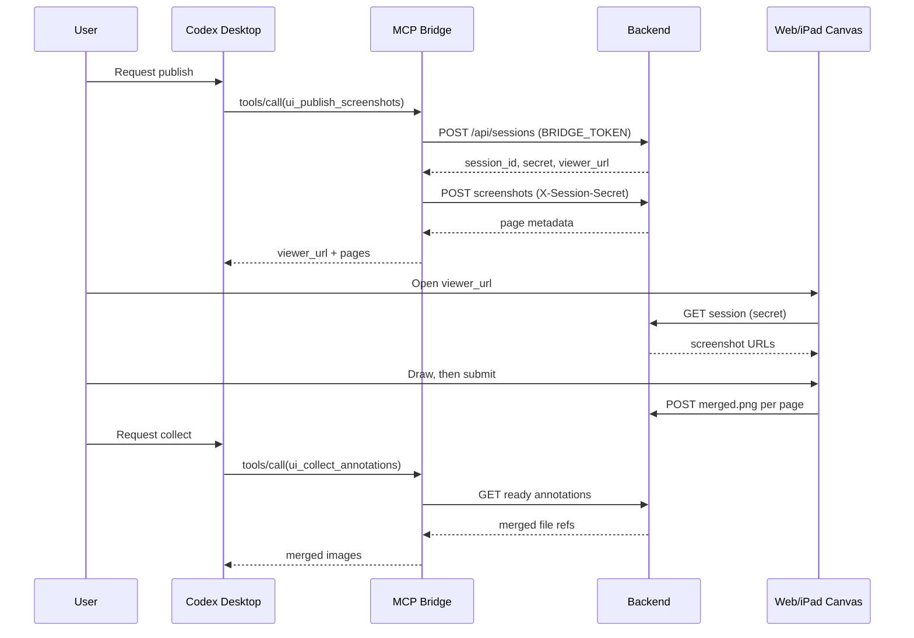

# LikeWater MVP Design (Simplified)

**Date:** 2026-06-27
**Status:** Updated simplified MVP design
**Workspace:** `/Users/ryu/projects/AgenticProjects/LIKE-WATER`
**Relationship to prior drafts:** This main design document has been simplified from the earlier 1025-line version after review of `2026-06-27-codex-ui-loop-mvp-design.simplified.md`. The `*.reviewed.md` and `*.simplified.md` files remain as review artifacts. Design principle for this round: **meet the functional requirements with the least possible surface; subtract before adding.**

## Scope decisions locked for this round

- **Multi-screenshot per session: KEPT** (hard requirement). Pages, prev/next, optional labels stay.
- **Output: merged only.** The transparent overlay is dropped from the MVP (it only served future editable workflows).
- **Public reachability: KEPT** (hard requirement). Reached via a user-controlled HTTPS tunnel. This forces exactly one addition — a shared `BRIDGE_TOKEN` on session creation — and nothing more.

What was removed versus the previous draft (no loss to the core loop): overlay output, `sha256`, `tool_meta`, `include_overlay`/`include_merged`/`page_indices` tool params, atomic temp-rename writes, the automated cleanup command, the multi-mechanism return fallback chain (`INLINE_IMAGE_MAX_MB` + path + HTTP link), and five of the eight config knobs.

## 1. Goal

One explicit, closed image feedback loop, local single-user, iPad-capable:

1. Codex explicitly publishes one or more UI screenshots (explicit MCP tool call only — never automatic).
2. The user opens the viewer URL on iPad or desktop and draws annotations.
3. The browser exports one merged annotated PNG per page and submits it.
4. Codex explicitly collects the merged annotated images.
5. Codex uses them as visual instruction for a focused UI change.

Success = this runs end to end with no manual file copying, on a real Codex build, with the screenshots reaching an iPad over the tunnel.

## 2. Non-Goals

Multi-tenant hosting, accounts/permissions, native iPadOS/PencilKit, real-time collaboration, vector/editable export, transparent-overlay output, persistent drawing history, automatic upload of arbitrary context images, auto code-edit without instruction, and OS-level screenshot capture. All remain valid future work; none is in the MVP.

## 3. Assumptions and Configuration

- macOS with Codex Desktop and local Node.js. Single trusted operator.
- The backend runs locally. Desktop browsers can use localhost; iPad access uses LAN or a user-controlled HTTPS tunnel.
- `viewer_url` is built from `PUBLIC_BASE_URL`, never hard-coded to `127.0.0.1`. For LAN access, `BIND_HOST` must be non-loopback and `PUBLIC_BASE_URL` must be reachable from the iPad. For a local tunnel agent on the same Mac, `BIND_HOST=127.0.0.1` is acceptable and safer.
- Screenshots are PNG. Backend, viewer page, and files are same-origin.
- Files are stored temporarily under the workspace and are secret-protected.

Configuration (env, in `.env.example`):

| Variable | Default | Purpose |
|---|---|---|
| `PORT` | `3939` | HTTP port. |
| `BIND_HOST` | `127.0.0.1` | Bind address. LAN use requires `0.0.0.0`; local tunnel agents may use `127.0.0.1`. |
| `PUBLIC_BASE_URL` | `http://127.0.0.1:3939` | Base for `viewer_url`. Must be a reachable LAN/tunnel URL for iPad. |
| `BRIDGE_TOKEN` | (required) | Shared secret required on `POST /api/sessions`. Held only by the MCP bridge. |

Everything else is a code constant: session TTL 24h, max PNG 15 MB, max 10 screenshots/session, `DATA_DIR = apps/backend/data/sessions`.

## 4. Architecture

Three thin parts, all on the local machine:

- **MCP bridge** — exposes the two explicit tools, calls the backend (holds `BRIDGE_TOKEN`), returns merged images to Codex. No storage, no image editing.
- **Backend (Node + Express + Multer 2.x)** — sessions, screenshot/annotation storage, same-origin authenticated file serving, upload limits. No DB, no accounts.
- **Web/iPad frontend** — shows screenshots, draws with Pointer Events (brush + eraser), exports the merged PNG, submits. Served as static files by the backend (same origin).

### Data flow



## 5. Repository Structure

```text
like-water/
├─ README.md
├─ package.json
├─ pnpm-workspace.yaml
├─ .env.example
├─ apps/
│  ├─ backend/
│  │  ├─ package.json
│  │  └─ src/
│  │     ├─ server.mjs
│  │     ├─ routes/{sessions,screenshots,annotations,files}.mjs
│  │     └─ lib/{store.mjs,png.mjs,ids.mjs}
│  ├─ web/public/{index.html,styles.css,app.js}
│  └─ mcp-bridge/
│     └─ src/{index.mjs,backend-client.mjs,tools/{publish.mjs,collect.mjs}}
└─ docs/superpowers/specs/
```

## 6. Data Model

Session (`session.json`):

```json
{
  "session_id": "sess_20260627_8f4a1b9c0d2e3f4a",
  "session_secret": "sec_32_random_urlsafe_chars",
  "title": "Settings page review",
  "viewer_url": "https://example.trycloudflare.com/s/sess_20260627_8f4a1b9c0d2e3f4a?secret=...",
  "created_at": "2026-06-27T10:00:00.000Z",
  "expires_at": "2026-06-28T10:00:00.000Z",
  "screenshots": [],
  "annotations": []
}
```

- `session_id`: date prefix + ≥16 random hex chars. `session_secret`: required on every session-scoped endpoint including file reads.
- `viewer_url` built from `PUBLIC_BASE_URL`. `expires_at` = created + 24h; expired sessions reject new uploads.

Screenshot:

```json
{ "screenshot_id": "shot_0001", "page_index": 1, "label": "Settings page",
  "image_url": "/files/sessions/<sid>/screenshots/shot_0001.png", "width": 1440, "height": 900 }
```

- `page_index` starts at 1. `label` optional. `image_url` is a secret-free relative path; the browser appends `?secret=...`. `width`/`height` are parsed from the PNG IHDR, not trusted from the client.

Annotation (merged only):

```json
{ "annotation_id": "ann_0001", "screenshot_id": "shot_0001", "page_index": 1,
  "merged_png_url": "/files/sessions/<sid>/annotations/shot_0001-merged.png",
  "updated_at": "2026-06-27T10:05:00.000Z" }
```

- At most one annotation per screenshot; re-submit replaces the file.

## 7. Backend API

All session-scoped endpoints (including file reads) require the session secret via `X-Session-Secret` header, or `?secret=` for browser navigation and `` loads. `POST /api/sessions` additionally requires `X-Bridge-Token`.

**`POST /api/sessions`** — header `X-Bridge-Token`. Body `{ title }`. Returns `{ session_id, session_secret, viewer_url, expires_at }`. `title` required, trimmed, ≤120 chars. `viewer_url` from `PUBLIC_BASE_URL`.

**`POST /api/sessions/:sessionId/screenshots`** — `multipart/form-data`, `X-Session-Secret`, `files[]`, optional `labels[]`. Returns the created page metadata. Limits: ≤10 files, ≤15 MB each. PNG magic bytes are checked and width/height parsed from IHDR **before** the file is written; rejected files are never stored. `labels[]` maps to `files[]` by upload order; missing labels become empty.

**`GET /api/sessions/:sessionId?secret=...`** — returns session, screenshots, and annotations. Persisted file URLs are secret-free relative paths; the frontend appends `?secret=...` before assigning to image elements.

**`POST /api/sessions/:sessionId/annotations/:screenshotId`** — `multipart/form-data`, `X-Session-Secret`, file `merged_png`. Returns `{ annotation_id, ready: true, merged_png_url, updated_at }`. `screenshotId` must belong to the session; `merged_png` required and must be PNG.

**`GET /api/sessions/:sessionId/annotations/ready?secret=...`** — returns all ready annotations for the session (no page filtering): `{ ready_count, items: [{ annotation_id, screenshot_id, page_index, merged_png_url, merged_png_path, updated_at }] }`. `merged_png_path` is the backend's absolute local path, used by the co-located bridge.

**`GET /files/sessions/:sessionId/:kind/:fileName?secret=...`** — `kind` ∈ {`screenshots`,`annotations`}. Requires the session secret; the session must exist and not be expired. Rejects any id/kind/fileName containing `/`, `..`, backslash, or null byte, and any resolved path that escapes `DATA_DIR`. Serves `image/png` only.

## 8. MCP Tools

Two tools. Collection returning `ready_count: 0` makes a separate "check" tool unnecessary.

**`ui_publish_screenshots`** — input `{ session_title (1..120), screenshot_paths (1..10), labels? (≤10) }`, `additionalProperties: false`. The bridge verifies the local PNGs exist, creates a session (with `BRIDGE_TOKEN`), uploads them, and returns text + `structuredContent { session_id, viewer_url, uploaded_pages[] }`. The text includes the viewer URL and the instruction "do not modify code until annotations are collected."

**`ui_collect_annotations`** — input `{ session_id, session_secret }`, `additionalProperties: false`. Returns all ready merged pages. If none, returns text + `ready_count: 0`. For each ready page it returns one short text marker naming the page (e.g. `Page 1 (Settings page):`) followed by that page's merged image, plus `structuredContent` with per-page refs.

**Return mechanism — pick one, build one.** Codex clients differ in whether they render inline base64 image content versus a local file path in tool output. **Day-1 spike** confirms which this build renders; implement only that one. Because the bridge, backend, and Codex are co-located, the bridge gets bytes (or the absolute path) directly from disk via `merged_png_path` — no HTTP self-fetch. Do not build a multi-mechanism fallback chain.

## 9. Frontend

**UI:** screenshot viewport; prev/next page buttons (multi-screenshot); brush; eraser; color swatches; line-width; submit; save-status. The drawing canvas sets `touch-action: none`. No marketing text; quiet, compact, touch-usable.

**Canvas:** base image + one annotation canvas. Eraser uses `globalCompositeOperation = "destination-out"` on the annotation canvas.

**Pointer input:** accept `pen`/`touch`/`mouse`; `touch-action: none` so iPad input does not scroll/zoom; use `event.pressure` for pen (fallback `0.5` when missing/zero); use `getCoalescedEvents()` when present; `setPointerCapture` on down. Map CSS coords to native screenshot pixels: `nativeX = cssX * (imageWidth / cssWidth)` (and Y).

```javascript
const pressure = event.pointerType === "pen" ? (event.pressure || 0.5) : 0.5;
const width = baseWidth * (0.6 + pressure * 1.2);
```

**Export:** the annotation canvas bitmap equals the screenshot's native `width`/`height` (CSS may scale the display, but drawing is in native pixels). Export `merged_png` = base screenshot drawn first, annotation second, via `canvas.toBlob(cb, "image/png")`. The base image must be same-origin. On export failure, show an error and do not submit.

## 10. Storage

```text
apps/backend/data/sessions/<sid>/
├─ session.json
├─ screenshots/shot_0001.png
└─ annotations/shot_0001-merged.png
```

- Stored filenames are backend-generated; no client filename is used.
- The file route checks secret, existence, and expiry, rejects path traversal, and confines resolved paths to `DATA_DIR`.
- Plain writes (single user, sequential). Expired sessions return 410 at request time; deleting old session directories is manual (`rm -rf`) for the MVP.

## 11. Security and Privacy (P0)

- Per-session random secret (≥date+16 hex id; 32-char secret) required on every session-scoped endpoint, including file reads.
- `POST /api/sessions` requires `BRIDGE_TOKEN` — the only pre-secret entry, kept closed so public/tunnel exposure cannot create sessions or fill disk.
- Public reach goes through a user-controlled **HTTPS** tunnel (the tunnel terminates TLS; no in-app cert handling). Bind `127.0.0.1` by default; non-loopback binding is explicit.
- PNG magic-byte validation before storage; IHDR-derived dimensions; backend-generated filenames; path-traversal-safe file route.
- Upload limits: 15 MB/PNG, 10 screenshots/session, 24h TTL.
- **Residual risk:** the secret travels in the viewer URL (browser history, possibly tunnel logs). Accepted for the MVP given HTTPS + 24h TTL. One-time viewer tokens are deferred (§14).

## 12. Errors

- Bridge: missing/invalid screenshot path → text error; backend unreachable → text error with URL; no ready annotations → `ready_count: 0` (not an error).
- Backend: missing secret 401; wrong secret/token 403; expired 410; unknown session/screenshot 404; too many/oversized 413; invalid PNG 415; bad JSON/path 400.
- Frontend: screenshot load fail → retry + URL; export fail → error, block submit; upload fail → keep drawing, allow retry; expired → disable submit.

## 13. Testing

- **Backend:** create-session requires `BRIDGE_TOKEN` and builds `viewer_url` from `PUBLIC_BASE_URL`; upload rejects missing secret and non-PNG; dimensions parsed from IHDR (client values ignored); filenames are generated; file reads reject missing/wrong secret, path traversal, and paths outside `DATA_DIR`; ready returns `0` before upload and the merged metadata after; expired returns 410.
- **Bridge:** publish rejects missing local files before creating a session, then uploads and returns page metadata; collect returns `0` when none ready and the merged pages when ready.
- **Frontend:** page loads screenshots; image requests carry the secret; canvas uses `touch-action: none`; draw changes pixels; eraser clears; coords map CSS→native; export produces a merged PNG at native dimensions; submit sends `merged_png`.
- **Manual E2E:** start backend → start/register bridge → publish a sample PNG → open the viewer on an iPad through the tunnel URL → draw + erase + submit → collect → confirm Codex receives the merged image.

## 14. Three-Day Plan

**Day 1 — Publish + de-risk.** Monorepo scaffold; `.env.example`; create-session (with `BRIDGE_TOKEN`); screenshot upload + storage; same-origin authenticated file serving; `ui_publish_screenshots`. **Spike:** return a known PNG from a throwaway MCP tool and confirm which mechanism this Codex build actually renders; lock it. *Done when:* a local PNG publishes and the `PUBLIC_BASE_URL` viewer loads it.

**Day 2 — Annotate.** Viewer with prev/next; brush; eraser; `touch-action: none`; native-pixel mapping; merged export; annotation upload. *Done when:* the user draws, erases, submits, and the merged file is on disk.

**Day 3 — Collect + public.** `ui_collect_annotations` (all ready merged via the locked mechanism); request-time expiry; README; E2E manual record; tunnel smoke test from an iPad over HTTPS. *Done when:* Codex collects a merged annotation and uses it as visual feedback.

## 15. Deferred (explicitly not built now)

Transparent overlay / editable export; a second return mechanism; atomic temp-rename writes; automated cleanup; rate limiting; one-time viewer tokens; hosted backend; OS-level capture; shapes/undo/thumbnails; WebSocket push; `ops.json`; native PencilKit; team features.

## 16. Key Risks

- **Return mechanism unknown** → Day-1 spike; build only the confirmed one.
- **Public exposure** → `BRIDGE_TOKEN` on the only open endpoint + HTTPS tunnel + 24h TTL.
- **Retina misalignment** → all drawing/export in native screenshot pixels.
- **Disk growth** → size/count limits + TTL (manual cleanup).
- **Scope creep into a drawing app** → brush/eraser/color/width/export/submit only.

## 17. References

- Codex MCP: <https://developers.openai.com/codex/mcp>
- MCP tools spec: <https://modelcontextprotocol.io/specification/2025-06-18/server/tools>
- PointerEvent.pressure: <https://developer.mozilla.org/en-US/docs/Web/API/PointerEvent/pressure>
- getCoalescedEvents: <https://developer.mozilla.org/en-US/docs/Web/API/PointerEvent/getCoalescedEvents>
- Canvas.toBlob: <https://developer.mozilla.org/en-US/docs/Web/API/HTMLCanvasElement/toBlob>
- Multer: <https://expressjs.com/en/resources/middleware/multer.html>
