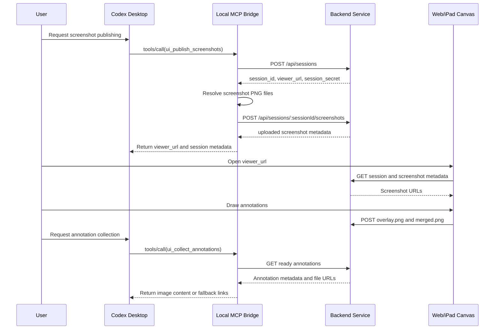

# FlowImage MVP Design (Reviewed Artifact)

**Date:** 2026-06-27  
**Status:** Reviewed design artifact  
**Workspace:** `/Users/ryu/projects/AgenticProjects/like-water/flow-image`  
**Current repository state:** Historical review artifact; implementation now lives in this FlowImage workspace.

---

## 审校意见汇总 (Review Notes)

> 本文件是审校副本，由 Claude 于 2026-06-27 生成。当前主文档为 `2026-06-27-flow-image-mvp-design.md`。下方正文中以引用块插入的 `[审校]` 段落即为修订意见。
>
> **图例：** 🔴 严重（与核心用例冲突或存在安全风险，需在动工前解决）· 🟠 重要（建议在对应阶段优先处理）· 🟡 次要（可改进，风险较低）
>
> **总体评价：** 文档结构完整、范围克制、closed-loop 拆解清晰，三天 sprint 的边界划得相当好，安全/降级/测试都有覆盖，是一份高质量的 MVP 设计。主要问题集中在三处与"iPad 标注"这一核心用例直接相关的实现前提上：(1) iPad 是核心载体，但生成的 `viewer_url` 用 `127.0.0.1`，iPad 实际无法访问；(2) `/files/...` 静态文件读取是否校验 secret 未写清，敏感截图可能被未授权下载；(3) Retina 缩放与 `touch-action` 缺失会直接影响标注在 iPad 上的可用性与合成对齐精度。按优先级：
>
> **🔴 严重**
> 1. **iPad 无法访问 `127.0.0.1`**（§4、§8.1、§9.1）：viewer_url 必须用可配置的 LAN IP / tunnel 域名，需引入 `PUBLIC_BASE_URL`。
> 2. **文件读取端点的鉴权与路径穿越**（§9、§12）：`/files/sessions/...` 是 GET，§9 只要求"状态变更端点"带 secret，未覆盖文件读取；截图含敏感信息，需明确文件 GET 也校验 secret，并对路径参数做防穿越校验。
>
> **🟠 重要**
> 3. **Retina/devicePixelRatio 对齐**（§11.4）：overlay 必须按截图原生像素尺寸导出，否则 merged 错位/模糊。
> 4. **`touch-action: none`**（§11.3）：canvas 缺此设置，iPad 上画笔会触发页面滚动，无法绘制。
> 5. **base64 图片返回体积 + fallback 精度**（§10.2）：15MB PNG → ~20MB base64 经 stdio 返回不可靠；fallback 的 HTTP resource link 对本地 Codex 价值低，应优先本地绝对路径。
> 6. **Multer 版本与校验时机**（§6.1、§9.2）：固定 2.x，先校验 PNG magic bytes 再落盘并清理被拒文件。
> 7. **缺少配置/环境变量章节**（§4、§7）：集中枚举 `PORT`、`BIND_HOST`、`PUBLIC_BASE_URL`、`SESSION_TTL_HOURS`、`MAX_PNG_MB` 等。
>
> **🟡 次要**
> 8. secret 写在 URL 会进入浏览器历史/日志，经 tunnel 更敏感（§13）。
> 9. 明确 `apps/web` 静态资源由 backend 同源托管（§6.1）。
> 10. `session.json` 与 overlay/merged 文件对的并发/原子写入（§8、§12）。
> 11. `labels[]` 与 `files[]` 的对应关系未定义（§9.2）。
> 12. `source` 强制等于 `codex-desktop` 偏严，建议放宽为默认值（§9.1）。

---

## 1. Executive Summary

This MVP builds a local, explicit image feedback loop between Codex Desktop and an iPad/Web annotation surface. The smallest reliable version has three thin parts:

1. A local Codex-side MCP bridge.
2. A lightweight Node.js web service.
3. A browser annotation canvas that works on iPad and desktop browsers.

The central product rule is explicit dispatch: screenshots only enter the loop when the user or agent explicitly calls a named MCP tool. Ordinary conversation images, attachments, browser screenshots, and context images do not automatically upload or enter this workflow.

The MVP optimizes for one successful closed loop:

1. Codex explicitly publishes one or more UI screenshots.
2. The user opens a web/iPad URL and draws annotations.
3. The browser exports both a transparent annotation overlay and a merged annotated image.
4. Codex explicitly collects the completed annotations.
5. Codex can use the returned image context to propose or apply a focused UI patch.

The first version is a local single-user tool. It does not attempt to become a multi-user review platform, a full image editor, or a public SaaS service.

## 2. Goals

### 2.1 Product Goals

- Provide a clear manual bridge from Codex UI screenshots to iPad/Web annotation and back.
- Prevent accidental upload of unrelated images by requiring explicit MCP tool calls.
- Preserve both visual clarity for Codex and editability for future workflows through dual PNG outputs.
- Keep the interaction simple enough to demonstrate end to end within a three-day sprint.

### 2.2 Engineering Goals

- Use boring, inspectable technology: Node.js, Express, Multer, browser Canvas, Pointer Events, and plain JavaScript.
- Keep each subsystem small and independently testable.
- Prefer same-origin file serving to avoid Canvas export failures caused by cross-origin image tainting.
- Provide a fallback path when MCP image content return is not fully supported by the active Codex client.
- Include minimal but real safety boundaries for local screenshots: per-session secret, upload limits, PNG validation, and file cleanup.

### 2.3 Success Criteria

The MVP is successful when this demo works without manual file copying:

1. A Codex MCP tool call creates a session and uploads at least one PNG screenshot.
2. The returned `viewer_url` opens a browser page showing the screenshot.
3. The user can draw, erase, and submit annotations.
4. The backend stores both `overlay.png` and `merged.png`.
5. A Codex MCP tool call retrieves completed annotations.
6. The MCP result returns structured metadata and either image content or stable local/resource links.
7. Codex can inspect the merged annotated image and describe the intended UI change.

## 3. Non-Goals

The MVP does not include:

- Public multi-tenant hosting.
- Account registration or team permissions.
- Native iPadOS or PencilKit implementation.
- Real-time collaborative drawing.
- Full vector editing or editable SVG export.
- Persistent operation-level drawing history as a required feature.
- Automatic upload of arbitrary Codex context images.
- Automatic code modification immediately after collection without user instruction.
- Complex screenshot targeting across all operating systems and window managers.

These features remain valid future directions, but including them in the first iteration would weaken the core closed-loop delivery.

## 4. Assumptions and Constraints

- Primary platform is macOS with Codex Desktop and local Node.js available.
- The first user is a single trusted local user.
- The iPad/Web annotation page can reach the local backend over localhost, LAN, or a developer tunnel controlled by the user.
- Screenshots are PNG files.
- The backend, viewer page, screenshots, and annotation files are served from the same origin.
- The system is allowed to store local image files temporarily under the project workspace.
- MCP image return is attempted first; local path or resource-link fallback is required.
- The current workspace is empty and not a git repository, so committing the design document is not possible until the user initializes git.

> **[审校 🔴 #1 — iPad 实际无法访问 `127.0.0.1`]** 文档把 iPad 作为核心标注载体，但 §8.1/§9.1 生成的 `viewer_url` 是 `http://127.0.0.1:3939/...`。`127.0.0.1` 是 iPad 自身的回环地址，无法连到 Mac。要让 iPad 能打开标注页，必须用 Mac 的 LAN IP 或 tunnel 域名来拼 `viewer_url`（桌面浏览器才可继续用 `127.0.0.1`）。**建议：** 新增 `PUBLIC_BASE_URL` 环境变量，create-session 用它生成 `viewer_url`；并在本节"假设"里补一条："iPad 走 LAN/tunnel 时，对外 base URL 不能是回环地址。"
>
> **[审校 🟠 #7 — 缺少配置/环境变量章节]** 全文散落 `127.0.0.1`、`3939`、24h、15MB、10 等常量，但没有集中列出可配置项。**建议：** 新增一节"Configuration / 环境变量"，枚举并给默认值：`PORT`(3939)、`BIND_HOST`(127.0.0.1)、`PUBLIC_BASE_URL`、`SESSION_TTL_HOURS`(24)、`MAX_PNG_MB`(15)、`MAX_FILES_PER_SESSION`(10)、`DATA_DIR`，与 §7 的 `.env.example` 一一对应。

## 5. Recommended MVP Shape

The recommended path is a local single-user loop:

```text
Codex Desktop
  -> local stdio MCP bridge
  -> local Node.js backend
  -> browser/iPad annotation page
  -> local Node.js backend
  -> local stdio MCP bridge
  -> Codex Desktop
```

This shape is preferred because screenshots originate near the local desktop, the backend can serve files from one origin, and the browser UI can stay simple. The backend can later move to a hosted service after the local loop is proven.

## 6. Architecture

### 6.1 Components

#### Local MCP Bridge

Responsibilities:

- Expose explicit MCP tools to Codex.
- Create annotation sessions through the backend.
- Upload screenshot PNGs.
- Poll or fetch completed annotations.
- Return annotation metadata and image content or fallback links to Codex.

Dependencies:

- Node.js runtime.
- MCP server library or protocol helper.
- Backend HTTP API.
- Local screenshot source or local PNG file paths.

Out of scope:

- Long-term storage.
- Image editing.
- UI rendering.
- Automatic model interpretation of annotations.

#### Backend Web Service

Responsibilities:

- Create sessions.
- Store screenshots and annotation outputs on disk.
- Serve static frontend files.
- Serve image files from the same origin.
- Accept multipart uploads.
- Enforce upload and retention limits.
- Provide annotation readiness endpoints.

Dependencies:

- Node.js.
- Express.
- Multer current patched version.
- Local filesystem storage.

> **[审校 🟠 #6 — Multer 版本与校验时机]** "Multer current patched version" 太含糊。**建议：** 固定到 **Multer 2.x**（1.x 维护状态差、有已知问题），并明确策略——用 `memoryStorage`（或先写临时文件），**在 PNG magic bytes 校验通过后再落盘**，被拒文件要清理，避免非法/超大内容直接写进 `screenshots/`。仅接受 PNG 的场景下，memory storage + 体积上限 + 魔数校验通常比 disk storage 更干净安全。
>
> **[审校 🟡 #9 — 同源托管需点明]** `apps/web` 有独立 `package.json`，但 §9 的 `viewer_url`、`/files/...`、`/api/...` 都落在同一端口。**建议：** 在职责里明确——viewer 页面与静态资源（index.html / app.js / styles.css）由 backend 同源托管（backend 直接 serve `apps/web/public`）。这正是 §6.2/§18 "避免 Canvas 跨域 taint" 成立的前提，值得写清而非隐含。

Out of scope:

- User account system.
- Public object storage.
- Database server.
- Real-time collaboration.

#### Web/iPad Annotation Frontend

Responsibilities:

- Display uploaded screenshots.
- Support pen, touch, and mouse drawing through Pointer Events.
- Support basic brush and eraser tools.
- Export transparent overlay PNG.
- Export merged screenshot-plus-annotation PNG.
- Submit completed annotations to the backend.

Dependencies:

- Browser Canvas API.
- Pointer Events.
- Fetch and FormData.

Out of scope:

- Native PencilKit.
- Advanced shape editing.
- Shared live cursors.
- Complex layer management.

### 6.2 Data Flow



## 7. Repository Structure

The planned repository structure is intentionally small:

```text
flow-image/
├─ README.md
├─ package.json
├─ pnpm-workspace.yaml
├─ .env.example
├─ apps/
│  ├─ backend/
│  │  ├─ package.json
│  │  ├─ src/
│  │  │  ├─ server.mjs
│  │  │  ├─ routes/
│  │  │  │  ├─ sessions.mjs
│  │  │  │  ├─ screenshots.mjs
│  │  │  │  └─ annotations.mjs
│  │  │  ├─ storage/
│  │  │  │  ├─ fs-store.mjs
│  │  │  │  └─ paths.mjs
│  │  │  └─ utils/
│  │  │     ├─ ids.mjs
│  │  │     └─ png.mjs
│  │  └─ data/
│  │     └─ sessions/
│  ├─ web/
│  │  ├─ package.json
│  │  └─ public/
│  │     ├─ index.html
│  │     ├─ styles.css
│  │     └─ app.js
│  └─ mcp-bridge/
│     ├─ package.json
│     └─ src/
│        ├─ index.mjs
│        ├─ backend-client.mjs
│        ├─ codex-return.mjs
│        ├─ capture/
│        │  └─ screenshot-source.mjs
│        └─ tools/
│           ├─ publish-screenshots.mjs
│           └─ collect-annotations.mjs
├─ packages/
│  └─ shared/
│     ├─ constants.mjs
│     └─ schemas.mjs
└─ docs/
   └─ superpowers/
      ├─ specs/
      └─ plans/
```

Files are split by responsibility. The backend owns storage and HTTP. The web app owns drawing and export. The MCP bridge owns Codex-facing tools and backend calls. Shared constants and schemas are kept minimal to avoid duplicating field names.

## 8. Data Model

### 8.1 Session

```json
{
  "session_id": "sess_20260627_8f4a1b",
  "session_secret": "sec_32_random_urlsafe_chars",
  "title": "Settings page review",
  "source": "codex-desktop",
  "viewer_url": "http://127.0.0.1:3939/s/sess_20260627_8f4a1b?secret=sec_32_random_urlsafe_chars",
  "created_at": "2026-06-27T10:00:00.000Z",
  "expires_at": "2026-06-28T10:00:00.000Z",
  "screenshot_count": 1,
  "annotation_ready_count": 0
}
```

Rules:

- `session_id` is stable and URL-safe.
- `session_secret` is required for viewer and upload endpoints.
- `expires_at` defaults to 24 hours after creation.
- Expired sessions are not listed or accepted for new uploads.

> **[审校 🔴 #1 续]** 上方示例 `viewer_url` 用了 `127.0.0.1`，仅对桌面浏览器有效。iPad 场景下该字段必须由 `PUBLIC_BASE_URL` 生成（见 §4 审校）。`session_secret` 32 字符是真正的访问控制，而 `session_id` 随机段只有 6 个 hex 字符（~24 bit）——见 §9 关于文件路由鉴权的审校。

### 8.2 Screenshot

```json
{
  "screenshot_id": "shot_0001",
  "session_id": "sess_20260627_8f4a1b",
  "page_index": 1,
  "label": "Settings page",
  "image_url": "/files/sessions/sess_20260627_8f4a1b/screenshots/shot_0001.png",
  "width": 1440,
  "height": 900,
  "sha256": "hex_encoded_sha256",
  "created_at": "2026-06-27T10:01:00.000Z"
}
```

Rules:

- `page_index` starts at 1.
- `image_url` is same-origin.
- PNG dimensions are read from the image file, not trusted from client input.

### 8.3 Annotation

```json
{
  "annotation_id": "ann_0001",
  "session_id": "sess_20260627_8f4a1b",
  "screenshot_id": "shot_0001",
  "page_index": 1,
  "overlay_png_url": "/files/sessions/sess_20260627_8f4a1b/annotations/shot_0001-overlay.png",
  "merged_png_url": "/files/sessions/sess_20260627_8f4a1b/annotations/shot_0001-merged.png",
  "tool_meta": {
    "pressure_supported": true,
    "tools_used": ["brush", "eraser"]
  },
  "updated_at": "2026-06-27T10:05:00.000Z"
}
```

Rules:

- Each screenshot has at most one current annotation record in the MVP.
- Re-submitting a screenshot annotation replaces the previous overlay and merged files.
- The backend treats both overlay and merged PNG as required.

## 9. Backend API

All state-changing endpoints require the session secret after session creation. The secret can be sent as `X-Session-Secret` or as the `secret` query parameter for browser navigation. API clients should prefer the header.

> **[审校 🔴 #2 — 文件读取端点也必须鉴权]** 这里只规定"状态变更端点"需要 secret，但截图/标注是通过 **GET `/files/sessions/...`**（非状态变更）读取的，而 §12 也仅说文件路由校验"session 是否存在及是否过期"。截图可能含敏感信息，因此 **文件 GET 必须同样校验 secret**（header 或 query），否则只要知道/猜到 `session_id` + `shot_xxxx` 即可下载。叠加 `session_id` 随机段仅 ~24 bit、文件名规律（`shot_0001`…）的事实，LAN 暴露时更危险——secret 是唯一可靠防线，别让文件路由绕过它。**建议：** 在本段把"文件读取端点"也纳入"需要 secret"的范围，并在 §12 同步。

### 9.1 Create Session

`POST /api/sessions`

Request:

```json
{
  "title": "Settings page review",
  "source": "codex-desktop"
}
```

Response:

```json
{
  "session_id": "sess_20260627_8f4a1b",
  "session_secret": "sec_32_random_urlsafe_chars",
  "viewer_url": "http://127.0.0.1:3939/s/sess_20260627_8f4a1b?secret=sec_32_random_urlsafe_chars",
  "expires_at": "2026-06-28T10:00:00.000Z"
}
```

Validation:

- `title` is required, trimmed, and limited to 120 characters.
- `source` must be `codex-desktop` for the MVP.

### 9.2 Upload Screenshots

`POST /api/sessions/:sessionId/screenshots`

Request:

- `multipart/form-data`
- Header: `X-Session-Secret`
- Files: `files[]`
- Optional fields: `labels[]`

Response:

```json
{
  "session_id": "sess_20260627_8f4a1b",
  "count": 1,
  "items": [
    {
      "screenshot_id": "shot_0001",
      "page_index": 1,
      "label": "Settings page",
      "image_url": "/files/sessions/sess_20260627_8f4a1b/screenshots/shot_0001.png",
      "width": 1440,
      "height": 900
    }
  ]
}
```

Validation:

- Maximum 10 files per request.
- Maximum 15 MB per PNG.
- File signature must match PNG magic bytes.
- Stored extension is always `.png`.

> **[审校 🟠 #6 续 / 🟡 #11]** (1) 魔数校验需在落盘前完成（见 §6.1 审校）。(2) §8.2 说尺寸"从文件读取"，建议点明实现：解析 PNG 的 **IHDR chunk** 取 width/height，不依赖客户端字段（也顺带验证这是结构合法的 PNG）。(3) `labels[]` 与 `files[]` 的对应关系未定义——是否按下标一一对应？当 `labels` 数量少于 `files` 时如何处理（留空/报错）？请补一句明确语义。

### 9.3 Get Session

`GET /api/sessions/:sessionId?secret=...`

Response:

```json
{
  "session_id": "sess_20260627_8f4a1b",
  "title": "Settings page review",
  "expires_at": "2026-06-28T10:00:00.000Z",
  "screenshots": [
    {
      "screenshot_id": "shot_0001",
      "page_index": 1,
      "label": "Settings page",
      "image_url": "/files/sessions/sess_20260627_8f4a1b/screenshots/shot_0001.png",
      "width": 1440,
      "height": 900
    }
  ],
  "annotations": []
}
```

### 9.4 Upload Annotation

`POST /api/sessions/:sessionId/annotations/:screenshotId`

Request:

- `multipart/form-data`
- Header: `X-Session-Secret`
- File: `overlay_png`
- File: `merged_png`
- Field: `tool_meta_json`

Response:

```json
{
  "annotation_id": "ann_0001",
  "ready": true,
  "overlay_png_url": "/files/sessions/sess_20260627_8f4a1b/annotations/shot_0001-overlay.png",
  "merged_png_url": "/files/sessions/sess_20260627_8f4a1b/annotations/shot_0001-merged.png",
  "updated_at": "2026-06-27T10:05:00.000Z"
}
```

Validation:

- `screenshotId` must belong to `sessionId`.
- `overlay_png` and `merged_png` are both required.
- Both files must be PNG.
- `tool_meta_json` must parse as an object when present.

### 9.5 Get Ready Annotations

`GET /api/sessions/:sessionId/annotations/ready?secret=...&page_indices=1,2`

Response:

```json
{
  "session_id": "sess_20260627_8f4a1b",
  "ready_count": 1,
  "items": [
    {
      "annotation_id": "ann_0001",
      "screenshot_id": "shot_0001",
      "page_index": 1,
      "overlay_png_url": "/files/sessions/sess_20260627_8f4a1b/annotations/shot_0001-overlay.png",
      "merged_png_url": "/files/sessions/sess_20260627_8f4a1b/annotations/shot_0001-merged.png",
      "updated_at": "2026-06-27T10:05:00.000Z"
    }
  ]
}
```

Rules:

- Missing `page_indices` returns all ready annotations for the session.
- Unknown page indices return no item for that page rather than failing the whole request.

## 10. MCP Tools

The MVP exposes two tools. A third check-only tool is unnecessary because collection can return `ready_count: 0`.

### 10.1 `ui_publish_screenshots`

Purpose:

Explicitly create a session and upload screenshot PNGs.

Input schema:

```json
{
  "type": "object",
  "properties": {
    "session_title": {
      "type": "string",
      "minLength": 1,
      "maxLength": 120
    },
    "screenshot_paths": {
      "type": "array",
      "items": { "type": "string" },
      "minItems": 1,
      "maxItems": 10
    },
    "labels": {
      "type": "array",
      "items": { "type": "string" },
      "maxItems": 10
    }
  },
  "required": ["session_title", "screenshot_paths"],
  "additionalProperties": false
}
```

MVP behavior:

- The bridge accepts explicit local PNG paths.
- The bridge verifies files exist before creating a session.
- The bridge uploads all valid PNGs to the backend.
- The bridge returns `session_id`, `viewer_url`, and uploaded page metadata.

Return content:

```json
{
  "content": [
    {
      "type": "text",
      "text": "Created annotation session sess_20260627_8f4a1b with 1 screenshot. Open http://127.0.0.1:3939/s/sess_20260627_8f4a1b?secret=... to annotate. Do not modify code until annotations are collected."
    }
  ],
  "structuredContent": {
    "session_id": "sess_20260627_8f4a1b",
    "viewer_url": "http://127.0.0.1:3939/s/sess_20260627_8f4a1b?secret=...",
    "uploaded_pages": [
      {
        "screenshot_id": "shot_0001",
        "page_index": 1,
        "label": "Settings page"
      }
    ]
  }
}
```

Future extension:

- Add `capture_target` after local PNG publishing is stable.
- Add macOS screenshot command profiles after permissions and Retina scaling are tested.

### 10.2 `ui_collect_annotations`

Purpose:

Explicitly collect ready annotations and return them to Codex.

Input schema:

```json
{
  "type": "object",
  "properties": {
    "session_id": {
      "type": "string",
      "minLength": 1
    },
    "session_secret": {
      "type": "string",
      "minLength": 1
    },
    "page_indices": {
      "type": "array",
      "items": { "type": "integer", "minimum": 1 },
      "maxItems": 10
    },
    "include_overlay": {
      "type": "boolean",
      "default": true
    },
    "include_merged": {
      "type": "boolean",
      "default": true
    }
  },
  "required": ["session_id", "session_secret"],
  "additionalProperties": false
}
```

MVP behavior:

- The bridge requests ready annotations from the backend.
- If none are ready, it returns a text result and `ready_count: 0`.
- If annotations are ready, it attempts to return `merged.png` image content first.
- It includes `overlay.png` image content when `include_overlay` is true.
- It always includes structured metadata with file URLs.
- If image content return is unsupported or fails, it returns local file paths or same-origin resource links in text and metadata.

> **[审校 🟠 #5 — 图片返回体积与 fallback 精度]**
> (1) **体积：** §13 允许 15MB PNG，转 base64 ≈ 20MB 文本，经 stdio 内联返回给 Codex 很可能被截断或拒绝。**建议：** 返回前对 merged 图做降采样（如长边 ≤ 1600px）专供模型查看，原图仍可经路径/链接获取；或对超过阈值的图直接跳过内联、只给路径。
> (2) **fallback 精度：** "same-origin resource link"（`http://127.0.0.1:.../files/...`）对本地 Codex 价值有限——除非客户端会主动发 HTTP 拉取该资源，这一点需确认（见 §19 的 MCP tools 规范）。更可靠的 fallback 是 **返回本地绝对文件路径**：bridge 与 backend 同机，可把抓到的字节落到本地临时文件后给出绝对路径，Codex Desktop 能直接读。**建议：** 把 fallback 优先级明确写为 image content → 本地绝对路径 →（最后）HTTP 链接，而非把"本地路径/HTTP 链接"并列。

Return content when ready:

```json
{
  "content": [
    {
      "type": "text",
      "text": "Collected 1 annotated page. Treat merged_png as the primary visual instruction and overlay_png as a supplemental reference."
    },
    {
      "type": "image",
      "mimeType": "image/png",
      "data": "base64_png_data"
    }
  ],
  "structuredContent": {
    "session_id": "sess_20260627_8f4a1b",
    "ready_count": 1,
    "annotations": [
      {
        "page_index": 1,
        "screenshot_id": "shot_0001",
        "merged_png_url": "/files/sessions/sess_20260627_8f4a1b/annotations/shot_0001-merged.png",
        "overlay_png_url": "/files/sessions/sess_20260627_8f4a1b/annotations/shot_0001-overlay.png"
      }
    ]
  }
}
```

## 11. Annotation Frontend Design

### 11.1 Required UI

The first viewer is a direct tool screen, not a landing page. It opens directly into the active session.

Required controls:

- Current screenshot viewport.
- Previous and next page buttons when there are multiple screenshots.
- Brush tool.
- Eraser tool.
- Color swatches.
- Line width control.
- Submit button.
- Save status indicator.

The UI does not need explanatory marketing text. It should be quiet, compact, and usable with touch.

### 11.2 Canvas Layers

The frontend uses three conceptual layers:

1. Base image layer: the screenshot.
2. Annotation canvas: permanent brush and eraser strokes.
3. Preview canvas: temporary shape previews in future versions.

For MVP, only base image plus annotation canvas is required. The eraser uses `globalCompositeOperation = "destination-out"` on the annotation layer.

### 11.3 Pointer Input

Pointer handling rules:

- Accept `pen`, `touch`, and `mouse`.
- Use `event.pressure` for pen width when available.
- Use fixed fallback pressure `0.5` when pressure is missing or zero.
- Use `getCoalescedEvents()` when present, otherwise process the original event.
- Call `setPointerCapture(pointerId)` on pointer down.

> **[审校 🟠 #4 — canvas 必须设 `touch-action: none`]** 规则里漏了关键一条：标注 canvas 必须设置 `touch-action: none`（CSS 或属性），否则在 iPad 上手指/Apple Pencil 一接触就触发页面滚动/缩放，`pointermove` 会被打断，根本画不了。这是触屏绘制可用的硬性前提。**建议：** 写进 §11.1 必备控件或本节规则。（顺带：iPad 上 `event.pressure` 对 Apple Pencil 有效，但部分手指/鼠标场景恒为 0，现有 `|| 0.5` 回退处理是对的。）

Brush width formula:

```javascript
const pressure = event.pointerType === "pen" ? (event.pressure || 0.5) : 0.5;
const width = baseWidth * (0.6 + pressure * 1.2);
```

### 11.4 Export

The browser exports two PNG blobs:

- `overlay_png`: annotation canvas only, transparent background.
- `merged_png`: offscreen canvas that draws the base screenshot first and annotation canvas second.

Export rules:

- Use `canvas.toBlob(callback, "image/png")`.
- If export fails, show a visible error state and do not submit a partial annotation.
- The base image must load from the same origin as the page.

> **[审校 🟠 #3 — Retina / devicePixelRatio 对齐]** macOS Retina 截图的原生像素是显示尺寸的 2x（如示例 1440×900 实际可能是 2880×1800）。若标注 canvas 按 CSS 尺寸建位图并导出，overlay 会只有底图一半大，merged 合成后**错位且模糊**。**必须：** canvas 的位图尺寸 = 截图原生像素尺寸（用 §8.2 存的 `width`/`height`），指针坐标按 `nativeWidth/cssWidth` 缩放映射，overlay 与 merged 都按原生尺寸导出。这影响 MVP 的合成精度，和"未来再做 macOS Retina capture profile"（§10.1）是两回事，需在本期处理。**建议：** 在导出规则里加一条"canvas 与导出均以截图原生像素为基准"。

## 12. Storage and File Layout

The backend stores files under:

```text
apps/backend/data/sessions/
└─ sess_20260627_8f4a1b/
   ├─ session.json
   ├─ screenshots/
   │  └─ shot_0001.png
   └─ annotations/
      ├─ shot_0001-overlay.png
      └─ shot_0001-merged.png
```

Rules:

- No user-provided filename is used as a stored filename.
- Files are served under `/files/sessions/...`.
- The static file route checks session existence and expiry.
- A cleanup command deletes expired session directories.

> **[审校 🔴 #2 续 — 路径穿越 + secret]** 文件路由的 `:sessionId` 与文件名来自 URL，即使 ID 由后端生成，也要拒绝含 `/`、`..`、空字节的参数，并把解析后的绝对路径**限定在 `DATA_DIR` 之内**，防止 `/files/sessions/../../...` 越权读取。此外本条只提"检查存在与过期"，应补上 **校验 secret**（见 §9 审校）。
>
> **[审校 🟡 #10 — 写入原子性]** 单 session 的 `session.json`（含 `screenshot_count`、`shot_xxxx` 计数器）在多次上传/标注回写时可能竞争损坏；overlay/merged 这对文件分两次写，中途失败会留下不匹配的半成品。单用户 MVP 风险低，但**建议：** 写 JSON 用 temp 文件 + `rename` 原子替换，overlay/merged 也先写临时再 rename，保证成对更新。

> **[审校 🟡 — 过期是请求时拒绝，清理靠手动]** 可补一句说明：过期在请求时返回 410（§14.2），磁盘文件要等 cleanup 命令运行后才真正删除，二者解耦。

## 13. Security and Privacy

The MVP is local and single-user, but screenshots can contain sensitive information. The following controls are P0:

- Every session has a random secret.
- Upload endpoints require the session secret.
- Viewer URLs include the secret only for convenience in local use.

> **[审校 🟡 #8 / #12 / 安全补充]**
> (1) secret 放在 URL 会进入浏览器历史与（若有）访问日志，经 tunnel 时还可能出现在隧道服务商侧。作为本地便利可接受，但**建议**补一句风险说明，并注明公网版应改为 header / 一次性令牌。
> (2) 应在 P0 列表里**显式加入**前面提到的两条：① 文件读取端点校验 secret；② 文件路由防路径穿越（限定在 `DATA_DIR` 内）。目前这两条散落在 §9/§12 审校中，但属于安全边界，宜在此集中声明。
> (3) `session_id` 随机段仅 ~24 bit，LAN 绑定时偏弱；真正防护是 secret + 文件路由鉴权。如成本低，可把随机段加长到 ≥ 16 hex 字符。
> (4) §9.1 强制 `source === "codex-desktop"` 偏严且无安全收益，**建议**放宽为"默认 `codex-desktop`、允许其它取值"，便于后续接入其它来源。

- Max PNG size is 15 MB.
- Max screenshots per session is 10.
- Max session lifetime is 24 hours by default.
- File type validation checks PNG magic bytes.
- Stored filenames are generated by the backend.
- The server binds to `127.0.0.1` by default.
- LAN binding requires an explicit environment variable.

Public deployment requires additional controls before use:

- HTTPS.
- Bearer token or stronger authentication.
- WSS for WebSocket if WebSocket is enabled.
- Lower per-request upload limits behind a reverse proxy.
- A storage retention policy visible to users.

## 14. Error Handling

### 14.1 MCP Bridge Errors

- Missing screenshot path: return text error listing the missing path.
- Non-PNG screenshot: return text error naming the rejected file.
- Backend unavailable: return text error with backend URL and connection failure.
- No ready annotations: return `ready_count: 0`, not an exception.
- Image return unsupported: return local/resource links in text and `structuredContent`.

### 14.2 Backend Errors

- Missing secret: HTTP 401.
- Incorrect secret: HTTP 403.
- Expired session: HTTP 410.
- Unknown session or screenshot: HTTP 404.
- Too many files or oversized upload: HTTP 413.
- Invalid PNG: HTTP 415.
- Invalid JSON field: HTTP 400.

### 14.3 Frontend Errors

- Screenshot fails to load: show a retry button and the image URL.
- Canvas export fails: show an export error and prevent submit.
- Annotation upload fails: keep current drawing in memory and allow retry.
- Session expired: show an expired state and disable submit.

## 15. Testing Strategy

### 15.1 Backend Tests

Required test coverage:

- Create session returns `session_id`, `session_secret`, `viewer_url`, and `expires_at`.
- Upload rejects missing secret.
- Upload rejects non-PNG content.
- Upload stores generated filenames rather than user filenames.
- Ready annotations returns `ready_count: 0` before annotation upload.
- Annotation upload requires both overlay and merged PNG.
- Ready annotations returns uploaded annotation metadata.
- Expired session returns HTTP 410.

### 15.2 MCP Bridge Tests

Required test coverage:

- `ui_publish_screenshots` rejects missing local files before creating a backend session.
- `ui_publish_screenshots` uploads valid PNG files and returns page metadata.
- `ui_collect_annotations` returns `ready_count: 0` when none are ready.
- `ui_collect_annotations` returns structured annotation metadata when ready.
- Image return fallback includes usable file or resource links.

### 15.3 Frontend Tests

Required test coverage:

- Session page loads screenshots from the API.
- Drawing on the canvas changes annotation pixels.
- Eraser clears annotation pixels.
- Export produces two PNG blobs.
- Submit sends both `overlay_png` and `merged_png`.

### 15.4 Manual Acceptance Test

Manual demo steps:

1. Start the backend.
2. Start or register the MCP bridge.
3. Publish a sample PNG screenshot through `ui_publish_screenshots`.
4. Open the returned viewer URL in a browser.
5. Draw at least one brush stroke.
6. Use the eraser on part of the stroke.
7. Submit the annotation.
8. Collect annotations through `ui_collect_annotations`.
9. Confirm Codex receives metadata and either image content or fallback links.

## 16. Three-Day Sprint Plan

### Day 1: Publish Path

Deliverables:

- Minimal monorepo scaffold.
- Backend session creation.
- Screenshot upload and storage.
- Same-origin file serving.
- MCP bridge with `ui_publish_screenshots`.
- Demo PNG upload path.

Completion check:

- A local PNG can be published through the MCP bridge.
- The returned viewer URL loads a page that can fetch session metadata and display the screenshot.

### Day 2: Annotation Path

Deliverables:

- Browser session viewer.
- Canvas brush.
- Canvas eraser.
- Overlay PNG export.
- Merged PNG export.
- Annotation upload endpoint.

Completion check:

- The user can draw on a screenshot, erase part of the drawing, submit, and see annotation files stored on disk.

### Day 3: Collection Path

Deliverables:

- `ui_collect_annotations`.
- Image return attempt.
- Fallback local/resource link return.
- Expiry and cleanup command.
- README with local demo instructions.
- End-to-end manual test record.

Completion check:

- Codex can explicitly collect an annotation and use the merged image as visual feedback for a UI change discussion.

## 17. Deferred Features

P1 after the MVP:

- WebSocket push for new screenshots and annotation status.
- Arrow tool.
- Rectangle tool.
- Ellipse tool.
- Undo and redo.
- Thumbnail navigation.
- macOS screenshot command profiles.

P2 after the MVP:

- `ops.json` drawing operation export.
- Hosted backend deployment.
- Account authentication.
- Team collaboration.
- Native iPadOS app with PencilKit.
- Persistent annotation history.
- Visual diff comparison.

## 18. Key Risks and Mitigations

### Risk: Local Screenshot Capture Is Harder Than Expected

Mitigation:

- The MVP accepts explicit local PNG paths.
- OS-level capture profiles are added only after publish and collect are stable.

### Risk: MCP Image Return Is Not Rendered as Expected

Mitigation:

- The bridge always returns structured metadata.
- The bridge always includes fallback local/resource links.
- The manual acceptance test verifies both the image path and fallback path.

### Risk: Canvas Export Fails Because of Cross-Origin Tainting

Mitigation:

- Backend serves the viewer, screenshots, and annotations from the same origin.
- MVP does not load screenshots from third-party URLs.

### Risk: Uploads Consume Disk Space

Mitigation:

- Limit PNG size to 15 MB.
- Limit screenshots per session to 10.
- Expire sessions after 24 hours.
- Provide a cleanup command.

### Risk: Frontend Scope Expands into a Drawing App

Mitigation:

- MVP supports brush, eraser, color, width, export, and submit only.
- Shapes, undo, thumbnails, and live sync are deferred.

## 19. References

- Codex MCP documentation: <https://developers.openai.com/codex/mcp>
- MCP tools specification: <https://modelcontextprotocol.io/specification/2025-06-18/server/tools>
- MDN PointerEvent pressure: <https://developer.mozilla.org/en-US/docs/Web/API/PointerEvent/pressure>
- MDN getCoalescedEvents: <https://developer.mozilla.org/en-US/docs/Web/API/PointerEvent/getCoalescedEvents>
- MDN Canvas toBlob: <https://developer.mozilla.org/en-US/docs/Web/API/HTMLCanvasElement/toBlob>
- MDN FormData: <https://developer.mozilla.org/en-US/docs/Web/API/FormData>
- MDN WebSocket: <https://developer.mozilla.org/en-US/docs/Web/API/WebSocket>
- Express Multer middleware: <https://expressjs.com/en/resources/middleware/multer.html>
